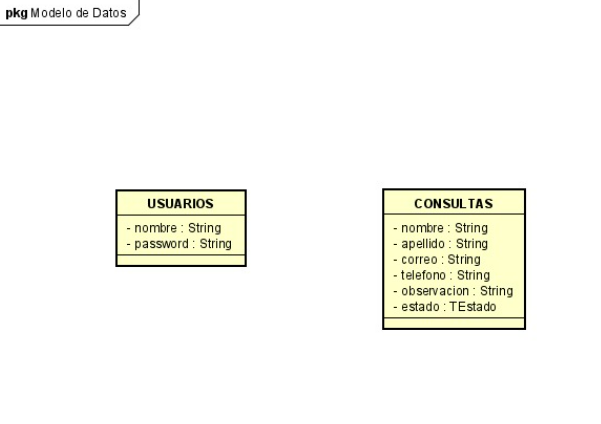
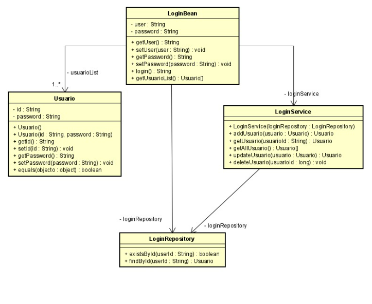

# hispanic american legal services

 

El proyecto se basa en una pagina principal para una abogada, donde existen dos secciones una privada(admin) a la cual se ingresa con un usuario y contraseña, por otra parte tenemos la del usurio normal(publica) donde este puede agendar un cita para tener una asesoria juridica.

## General

* **Asignatura** Ciclos de vida y desarollo de software
* **Periodo academico** 2023-1


## Authors

 
* **Ivan Dario Lemus Moya** - *Product Owner*
* **Sebastian David Blanco** - *Scrum Master*
* **Juan Pablo Daza** - *Scrum Developer*
* **Juan Sebastian Rodriguez** - *Scrum Developer*
* **Jose Alejandro Correa** - *Scrum Developer* 
 


## Getting Started

 

Se encuentra una pagina principal (/index.xhtml) donde el usuario puede crear una consulta, donde este tiene que poner una firma para aceptar los terminos y condiciones, ademas de que llegara una notificacion al correo que agrego confirmando la consulta creada

* queries2.xhtml

En cuanto al la parte de administracion, el administrador ingresa por medio de un login (/login.xhtml) con un usuario y contraseñas unicas.

* user = sebastian
* password = 123

Al ingresar encontrara una tabla con la informacion agregada por el usuario

* Correo
* Nombre
* Apellido
* Telefono
* Observacion (usuario)
* Estado (consulta)
* Firma
* Horario
* Boton de atender (Funcionalidad no implementada correctamente)


 

### Prerequisites

 

Para correr el proyecto se necesita maven y java, con el siguente comando se puede correr el proyecto 

 

```
mvn spring-boot:run
```

Para ir a la pagina principal, luego de correr el comando anterior entrar a [localhost](http://localhost:8080/index.xhtml) 

## Built With

 

* [PrimeFaces](https://www.primefaces.org/) - The web framework used
* [Maven](https://maven.apache.org/) - Dependency Management

 

 


## Architecture and design






## Acknowledgments

 

* Quiero expresar mi más sincera gratitud al equipo de ArtTk por su inestimable ayuda en el desarrollo de este proyecto de programación. 